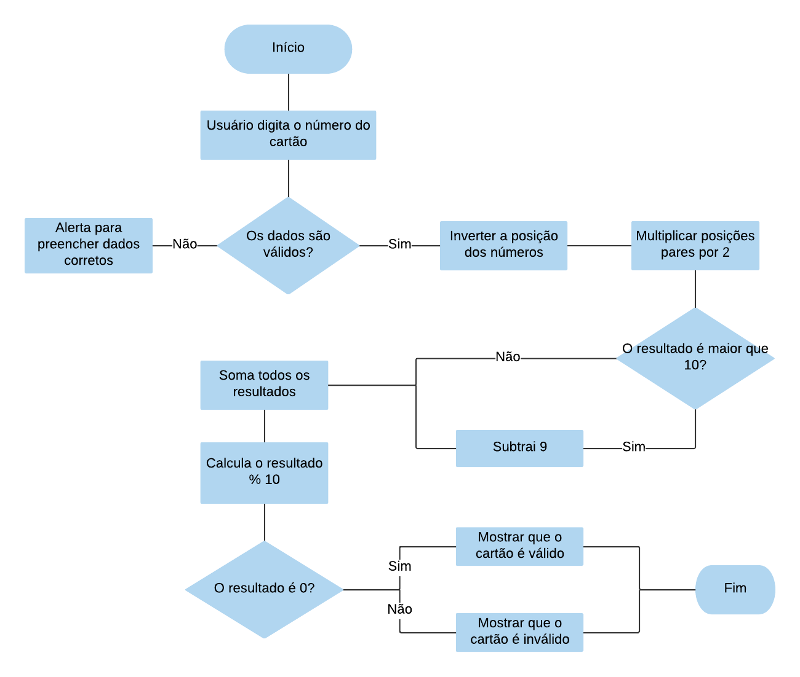

1. A função isValidCard começa com a variável numberCard que recebe o número que o usuário vai digitar.
2. Com uma condicional, compara se numberCard é diferente de vazio, e se o número digitado é um número de inteiro, para validar os dados.
3. Se os dados forem válidos, a variável arrayNumbers recebe um array com todos os digitos do cartão, através da função split.
4. A variável arrayNumbers recebe os digitos invertidos, através da função reverse.
5. Um loop, declara que i recebe 0. Enquanto i for menor que o tamanho de arrayNumbers, i recebe mais 2
6. O arrayNumber de indice com o valor da variável i, recebe ele mesmo multiplicado por 2.
7. Uma condicional compara se arrayNumbers de indice i é > 9. Se for, o arrayNumbers indice i, receberá ele mesmo subtraído de 9.
8. Declarei a variável sum, que recebe 0.
9. Um novo loop, começa com i = 0, enquanto i for menor que o tamanho de arrayNumbers, o i recebe mais 1.
10. A variável sum recebe ele mesmo mais arrayNumbers de indice i.
11. Uma nova condicional compara se a variável sum, módulo 10 é igual a 0. Se for igual a 0, a div result mostra a mensagem dizendo que "O número do cartão é válido". Se não a div result mostra a mensagem "O número do cartão é válido".
12. Se os dados inseridos pelo usuário não forem válidos, a div result mostra a mensagem "Digite apenas números".

 
